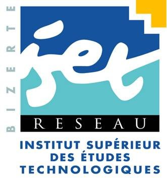

## Organisation du dossier

1. [Automatique](https://github.com/a-mhamdi/isetbz/tree/main/Automatique)
2. [Calcul scientifique](https://github.com/a-mhamdi/isetbz/tree/main/Calcul%20scientifique)
3. [Électronique analogique](https://github.com/a-mhamdi/isetbz/tree/main/Électronique%20analogique)
4. [Électronique de commande](https://github.com/a-mhamdi/isetbz/tree/main/Électronique%20de%20commande)
5. [Électronique numérique](https://github.com/a-mhamdi/isetbz/tree/main/Électronique%20numérique)
6. [Machine learning](https://github.com/a-mhamdi/isetbz/tree/main/Machine%20learning)
7. [Traitement de signal](https://github.com/a-mhamdi/isetbz/tree/main/Traitement%20de%20signal)
------
### **Automatique**
#### **cours-automatique-base**
*(signaux & systèmes, systèmes asservis, régulation)*
#### **cours-modélisation**
*(modélisation, modèle de comportement, identification graphique : BO & BF)*
#### **cours-systèmes-multivariables**
*(équation d'état, commandabilité, commande par retour d'état, observabilité et observateur d'état )*

### **Calcul scientifique**
*(calcul matriciel, résolution numérique des équations différentielles, interpolation polynomiale)*

### **Électronique analogique**
*(ALI, montages de base, générateur de signaux, filtres)*

### **Électronique de commande**
*(RS232, MAX232, ALI, NE555, commande en position)*

### **Électronique numérique**
*(aspects technologiques des circuits combinatoires, mémoires)*

### **Machine learning**
*(linear regression, classification, clustering, ann, cnn)*

### **Traitement de signal**
*(signaux : synthèse et représentation, convolution et filtrage, Fourier)*

